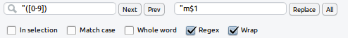

Regular expressions in R vs RStudio
========================================================

The 'regex' family of languages and
commands is used for manipulating text strings. More specifically, 
regular expressions are typically used for finding specific patterns of characters and
replacing them with others. These technique have a range of applications
and R's base installation has powerful regex tools (not to mention
add-on packages for string manipulation such as
[stringr](http://cran.r-project.org/web/packages/stringr/index.html)).
Yet regex in R is cause of much confusion, as indicated by the multitude of
[stackoverflow questions on the subject](http://stackoverflow.com/search?q=[r]+regex)
and the documentation is difficult for novices to the world of regex.

In this post we are going to see a few reproducible examples of R's
implementation of regular expressions and how it can make your life easier.
There is already much useful information on the topic such as a simple
how-to on using
[regex to load files with specific names](http://www.r-bloggers.com/making-regex-examples-work-for-you/),
an excellent introduction from [Regular-Expressions.info](http://www.regular-expressions.info/rlanguage.html)
and R's terse documentation on the matter triggered with `?regex`.
In an attempt to adhere to the DRY principle, this article will focus on
just three topics: R's basic regex commands, search and replace in R and
R Studio's implementation of regex. The final topic has rarely been discussed
yet understanding the differences between regex in R Studio's search panel
and in standard R can save much time.
R Studio's implementation of regex is [confusingly different](https://support.rstudio.com/hc/communities/public/questions/200641328-regex-replace?locale=en-us)
from R's default regex behavior.

## R's basic regex commands

Let us start with an example: illegal column names that describe
age categories, attributes and which we want to eventually
prefix with 'm'. Here are the original column names imported from Excel:

```{r}
x <- c("16_24cat", "25_34cat", "35_44catch", "45_54Cat", "55_104fat")
```

Imagine we first want to select all items in this string containing
'cat'. The basic regex command in R is `grep`, which simply
returns the index of the matching elements:

```{r}
grep(pattern = "cat", x = x)
```

Note that 'catch' was included whereas 'Cat' was not: the matching
pattern can appear anywhere in the text string but is case specific.
To make the search ignore cases, simply add the `ignore.case = T` argument.
To exclude 'catch', the dollar sign can be used. These arguments can be used
to extract the names we are really interested in:

```{r}
grep("cat$", x, ignore.case = T)
```

`grepl` is the same as `grep`, only it outputs a yes/now output for each element:

```{r}
grepl("cat$", x, ignore.case = T)
```

The final regex-related command worth knowing `strsplit`. Imagine
we want all characters on the right-hand side of the underscore.

```{r}
strsplit(x, split = "_")
```

Strangely, the hardest part of the `strsplit` function
is to re-combine the list output into a useful form.
For this, in base R, we need the power of `sapply`:

```{r}
sapply(strsplit(x, split = "_"), "[", 2)
```

A simpler way to achieve this same result would be to use the
`str_split_fixed` function of the `stringr` package:

```{r}
library(stringr)
str_split_fixed(x, "_", 2)[, 2]
```

## Finding and replacing in R

To search and replace the first instance of a pattern, use `sub`.
Much more useful is `gsub`, which replaces all instances.
To replace all instances of 'cat' with 'fat', use the following:

```{r}
gsub(pattern = "cat$", replacement = "fat", x = x, ignore.case = T)
```

Let's try something more complicated. We want all instances of
two numbers followed by an alphabet letter to have an additional character
inserted, but only if the first of those numbers is 3 or less:

```{r}
gsub("([1-3][1-9][a-z])", "m\\1", x, perl=T, )
```

The above syntax is bizarre, so let's run 
through it. 
- We have specified that we want [Perl-esque](http://www.regular-expressions.info/perl.html)
regex, allowing us to store groups for later referral. 
- The curved brackets
have no impact on the search result, but are used by Perl to store the contents
of the group. 
- The square brackets refer to any character matching the range of values indicated.
- the `\\1` symbol means "replace this with the value captured in group 1",
meaning that the same numbers are retained, even though the numbers were used in the match.

## Regular expressions in RStudio

The above bullet points may seem like a daunting amount of explanation 
for only one line of code, and the regex is still 
relatively simple! More complex commands can be done, especially when
the `perl = T` argument is enabled or using the more coherent `stringr`
package. However, one of the main uses that R users may have for regular
expressions is not their data per se - R is most useful for *quantitative* not
character information after all. Regular expressions can be hugely useful for
editing long R scripts to do different jobs.

R Studio's search and replace functionality is well known but the little "Regex"
tick mark is less so. 



Hitting that tick mark brings the whole power of Perl regex to bear on your
code editing: time spent learning the functionality of
regular expressions can pay dividends in fast code modification and
automation of repetitive tasks.

In fact, the example used throughout this article was originally implemented
in RStudio to change the name of text strings so they would be valid
column names. The text in the previous image means, in English, "search
for any instance of `"` followed by a number and then insert the letter `m`
directly after the quote mark and the number". This altered all the column names 
in an instant. 

Unfortunately, R Studio's website has little in the way of documentation
for this little feature (hint hint to any on the RStudio team reading this),
other than a
[thread about how it differs from R's implementation](https://support.rstudio.com/hc/communities/public/questions/200641328-regex-replace?locale=en-us), as covered
in this article.

## Conclusion

Clearly, there is large potential for confusion in R's implementation of
regular expressions. To pick one example, the group
register `$1` in RStudio and pure Perl is different from the `\\1` register used in R.
Yet it is well worth the effort of learning regex in R, as it opens up
huge possibility for the manipulation and analysis of text data as well
as automation of your own code re-writing.

This article and the reproducible examples, should be of use
to others. Understanding regular expressions in R and RStudio can make the
R programming process more powerful, less prone to human error and
faster. It is hoped that this will allow R users more time away from their computers,
to enjoy nature and hopefully to return to their computers with a refreshed desire
to learn and use their specialist skills for the greater good.


